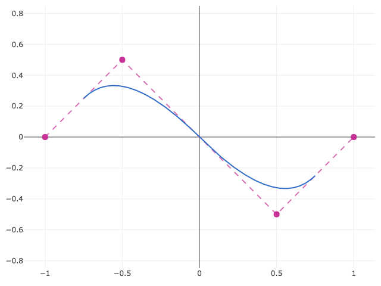
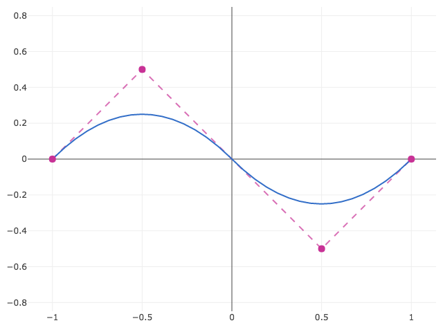
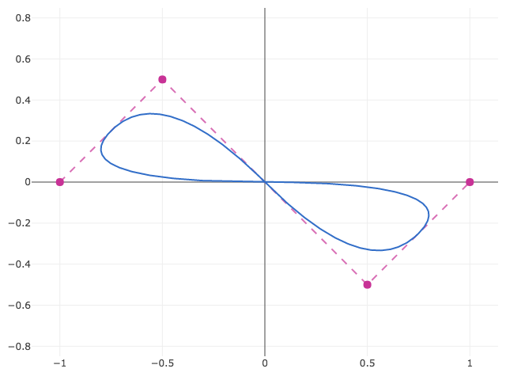
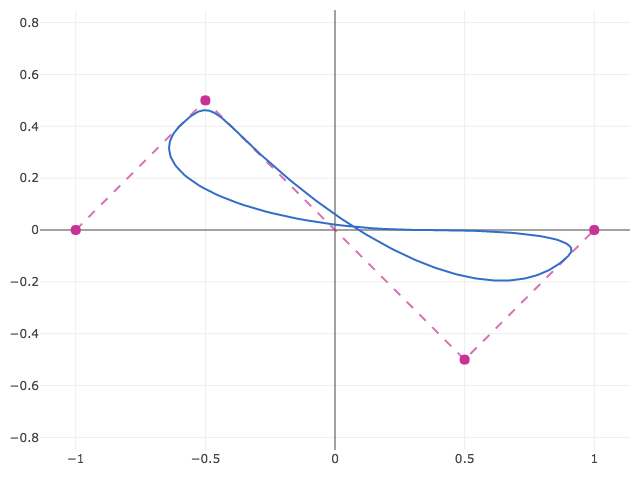
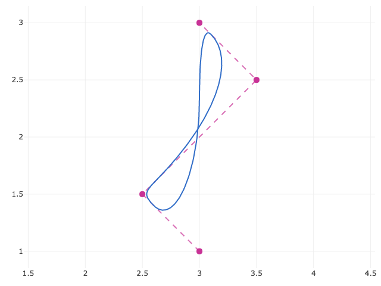
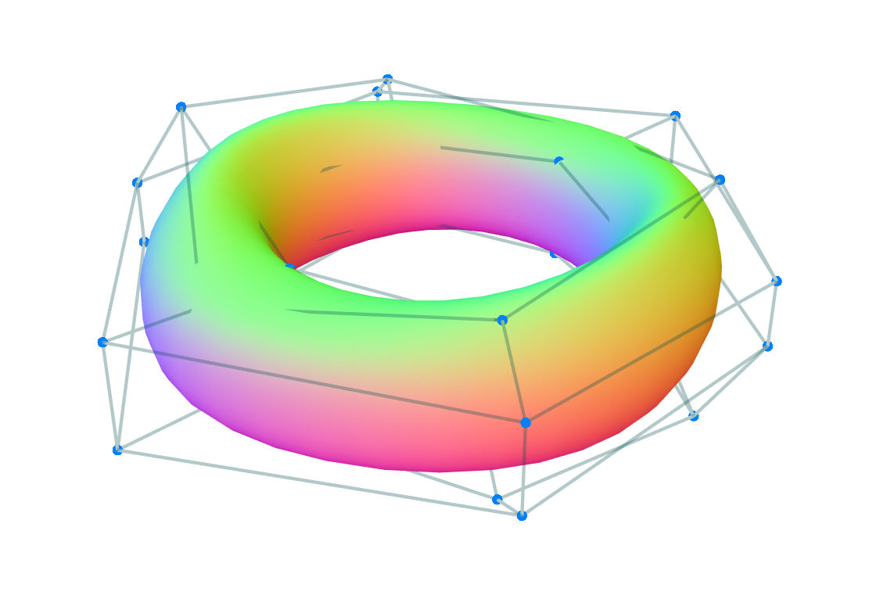

# nurbs

> [Non-Uniform Rational B-Splines][nurbs] (NURBS) of any dimensionality

This library implements n-dimensional [Non-Uniform Rational B-Splines][nurbs] (NURBS). It has no dependencies and uses code generation to unroll loops, optimize for various cases (uniform and non-uniform; rational and non-rational; clamped, open, and periodic) and allow compatibility with multiple input types (arrays of arrays, [ndarrays][ndarray]).

## Installation

**Not yet published.**

```bash
$ npm install nurbs
```

## Examples

### Open B-Spline

To construct an open quadratic B-Spline in two dimensions:
<!--The following example, instead of creating a new spline, this example updates the existing spline by calling the existing spline as a constructor, which re-runs the validations while preserving the same instance. (This feature may be removed. It's simple but weird and since the splines have very little internal state, it really doens't save much speed or allocation.) In general, references to the input data are retained so that you may mutate the data (including the number of points) after instantiation. If you change the degree or dimensionality of the curve though, you must either create a new curve or invoke the existing curve as a constructor and pass new data.-->

```javascript
var nurbs = require('nurbs');

var curve = nurbs({
  points: [[-1, 0], [-0.5, 0.5], [0.5, -0.5], [1, 0]],
  degree: 2
});

curve.domain;
// => [[2, 4]]

curve.evaluate([], 3.0);
// => [0, 0]
```

If you don't provide a knot vector, a uniform knot vector with integer values will be provided implicitly. In this case the knots would be `[0, 1, 2, 3, 4, 5, 6]`. The above example queries the valid domain using `curve.domain`, which returns a nested array since each dimension is parameterized separately. In this case that's just one dimension, from `t = 2` to `t = 4`. Plotting shows the open (unclamped) spline:

<p align="center">

</p>

### Clamped B-Spline

To construct a clamped spline, that is, a spline which passes through its endpoints, you may specify boundary conditions with the `boundary` property:

```javascript
curve = nurbs({
  points: [[-1, 0], [-0.5, 0.5], [0.5, -0.5], [1, 0]],
  degree: 2,
  boundary: 'clamped'
});

curve.domain;
// => [[2, 4]]
```

In this case the knots would be `[2, 2, 2, 3, 4, 4, 4]`, where the offset is a result of clamping of the open knot vector by repeating the first and last knots `degree + 1` times. As a result, the domain `[2, 4]` is unchanged from the previous example. For an existing spline, you could also call `curve` with new data in order to preserve the same instance while resetting and sanitizing all of the data, as in `curve({points: ...})`.

<p align="center">

</p>

### Closed B-Spline

A B-Spline can be made periodic by wrapping around and duplicating the first or last points a number of times equal to the degree. This library includes a `'closed'` boundary condition so that a spline can be closed without explicit repitition. If knots are not provided, that start of the domain becomes `t = 0`. The result contains the open spline from the first example with the same parameterization (`[2, 4]`) as well as a segment that closes the spline (`[0, 2]`).


```javascript
curve = nurbs({
  points: [[-1, 0], [-0.5, 0.5], [0.5, -0.5], [1, 0]],
  degree: 2,
  boundary: 'closed'
});

curve.domain
// => [[0, 4]]
```

Plotting shows the closed spline:

<p align="center">

</p>

### Closed NURBS

An unclosed NURBS spline requires `n + degree + 1` knots, where `n` is the number of points. A closed NURBS curve requires only `n + 1` knots. The periodicity is defined by equivalence of the first and last knot, i.e. `k_0 := k_n`. The knots then define `n` unique, periodic knot intervals. For example,

```javascript
curve = nurbs({
  points: [[-1, 0], [-0.5, 0.5], [0.5, -0.5], [1, 0]],
  weights: [0.5, 4, 1, 0.5],
  knots: [[0, 1, 3, 7, 15]],
  boundary: 'closed',
  degree: 2
});

curve.domain
// => [[0, 15]]
```

<p align="center">

</p>

### Basis functions

A spline does not pass through its control points. If you want to do more advanced analysis such as constructing a spline that passes through a set of points, you may evaluate the basis functions directly. If you don't yet have a set of points defining the spline, you may initialize a spline with a `size` instead of a set of points. Then to determine the contribution at `(u, v) = [1.3, 2.4]` of the very first point, indexed by `points[0][0]`:

```javascript
curve = nurbs({size: [10, 15]);
var basis = curve.basisEvaluator();
basis([], 1.3, 2.4, 0, 0);
```

You may also query which points contribute to a given paramter value with `support`:

```javascript
curve.support([], 1.3, 2.4)
```

### Transform

Each `nurbs` object has a `transform` method that accepts a matrix using gl-matrix style matrices. See [gl-mat2](https://github.com/gl-modules/gl-mat2), [gl-mat3](https://github.com/gl-modules/gl-mat3), and [gl-mat4](https://github.com/gl-modules/gl-mat4). For example, to apply a transformation in-place to the previous example:

```javascript
var m = mat3.identity([]);
mat3.translate(m, m, [3, 2, 0]);
mat3.rotate(m, m, Math.PI / 2);
curve.transform(m);
```

<p align="center">

</p>

### Curves, Surfaces, Volumes, etc.

The above concepts generalize to any dimensionality of spline surface and space dimensions. You can create a surface patch in three dimensions using the code below. In this case, each property is specified per-dimension.

```javascript
curve({
  points: [
    [[0, 2, 3], [4, 5, 6], [7, 8, 9]],
    [[1, 2, 2], [1, 2, 3], [4, 5, 6]],
    [[1, 2, 2], [1, 2, 3], [4, 5, 6]],
    [[1, 2, 2], [1, 2, 3], [4, 5, 6]],
  ],
  weights: [
    [[1, 2, 1], [1, 1, 1], [1, 1, 1]],
    [[1, 2, 1], [1, 2, 1], [1, 1, 1]],
    [[1, 2, 2], [1, 2, 1], [1, 1, 1]],
    [[1, 2, 2], [1, 2, 1], [1, 1, 1]],
  ],
  knots: [
    [0, 0, 0, 0, 0.5, 1, 1, 1, 1],
    [0, 0, 0, 1, 1, 1]
  ],
  boundary: ['closed', 'clamped'],
  degree: [3, 2],
});

curve.evaluate([], 0.5, 0.5);
```

[examples/3d.js](./examples/3d.js) shows a 3D surface created in this way using the [regl][regl] library.

<p align="center">

</p>

### ndarrays

Arrays of arrays are easy to work with for dynamically inserting and removing points, but can be somewhat slower with due to access and the allocation of many small arrays. `points` and `weights` also accept ndarrays (either array or typed array backed or generic get/set ndarrays). The object does not need to be an actual ndarray. Any object is acceptable as long as it has ndarray-style `data`, `shape`, `stride`, and `offset` properties.

The [ndarray-pack][ndarray-pack] module is a simple way to see the correspondence between array of arrays and ndarrays:

```javascript
var pack = require('ndarray-pack');

var points = [
  [[0, 2, 3], [4, 5, 6], [7, 8, 9]],
  [[1, 2, 2], [1, 2, 3], [4, 5, 6]],
  [[1, 2, 2], [1, 2, 3], [4, 5, 6]],
];

// These two are equivalent:
var curve1 = nurbs(pack(points));
var curve2 = nurbs(points);
```

## API

### `nurbs(points, degree, weights, knots, boundary, options)`
### `nurbs(options)`

Construct a NURBS object. Options are:
- **`points` (optional)**: An array of arrays or [ndarray][ndarray]-style object containing control points.
 
  If an array of arrays, the length of `points` corresponds to the number of points in the first spline dimension, the lenth of `points[0]` to the number of points in the second spline dimension, and so on. The number of components in the innermost array corresponds to the spatial dimension of the spline. For example, `[[[1, 2, 3], [4, 5, 6]], [[7, 8, 9], [10, 11, 12]]]` corresponds to a surface in three dimensions.

  If an ndarray, three variants are permitted.
    - Regular [ndarrays][ndarray] backed by an array or typed array of data.
    - Generic [ndarrays][ndarray] backed by `get` and `set` methods.
    - ndarray-like object containing `data`, `shape`, `stride`, and `offset` properties.

  Note that providing data as an ndarray is equivalent to running [ndarray-pack][ndarray-pack] on array-of-arrays-style data.

  If points is ommitted, then a `size` must be provided instead.

- **`weights` (optional)**: An array of arrays or [ndarray][ndarray]-style object containing control point weights. If not provided, the weight computation is omitted, which is equivalent to all weights equal to 1.
- **`degree` (optional, default `2`)**: Either an integer degree or an array of integer degrees for each spline dimension. Must be less than the number of points. If a degree is specified and insufficient points are provided, an error will be thrown. If the degree is unspecified and insufficient points are provided (i.e. two points), the degree will be downgraded to 1.
- **`knots` (optional)**: An array of knot vector arrays for each respective spline dimension. Each knot vector is presumed to be strictly nondecreasing.
- **`boundary` (optional, default `'open'`)**: An array of boundary conditions for each spline dimension or single non-array-wrapped boundary condition to be applied to all dimensions. Options are:
  - **`'clamped'`**: a spline that meets the control points at each end.
  - **`'open'`**: an evenly spaced knot vector such that the spline does not meet the control points
  - **`'closed'`**: equal to an open spline wherever the open spline is defined, with an additional section closing the gap to create a closed loop.

  Note that clamped on one end and open on the other is perfectly possible but requires specifying your own knot vector.

- **`opts` (optional)**: An object containing additional configuration options. Permitted options are:
  - **`debug` (boolean, default `false`)**: When true, writes the generated code to the console.
  - **`checkBounds` (boolean, default `false`)**: When true, checks each parameter against the dimension's domain and throws an error if a point outside the defined domain is evaluated. Behavior is undefined otherwise.
  - **`size` (array)**: if you only wish to evaluate the basis functions, you may omit points and provide an array containing the number of points in the control hull in each respective spline dimension. For example, a <em>5 &times; 3</em> control hull would be `size: [5, 3]`.

### Properties

- `domain` (Array): An array of arrays containing the minima and maxima for each spline dimension.
- `splineDimension` (Number): Dimensionality of the spline surface, e.g. curve = 1, surface = 2, etc.
- `dimension` (Number): Spatial dimension of the spline. One-dimensional = 1, 2D plane = 2, etc.
- `size` (Array): Size of the control point data.

### Methods

---

### `spline.evaluate(out, t0, t1, ..., tn_1)`

Evaluate the spline at the parameters <em>t<sub>0</sub></em>, ..., <em>t<sub>n - 1</sub></em> where <em>n</em> is the dimensionality of the surface (i.e. curve = 1, surface = 2, etc), and write the result to `out`. Returns a reference to `out`.

---

### `spline.derivativeEvaluator(n, dimension)`

Returns a function which evaluates the <em>n<sup>th</sup></em> partial derivative of the spline along dimension `dimension` (starting at `dimension = 0`). The function matches the signature and return value of `spline.evaluate`, writing the derivative components to `out`. `t0, t1, ... tn_1` are the coordinates from <em>t<sub>0</sub></em> to <em>t<sub>n - 1</sub></em> at which to differentiate. See \[1\] for more details.

Currently only the first derivative is implementd.

---

### `spline.basisEvaluator()`

Returns a function `basis(t0, t1, ..., tn_1, i0, i1, ..., in_1)` which evaluates the value of the spline basis functions for a given input input point and parameterized location. The input is the spline parameters <em>(t<sub>0</sub>, t<sub>1</sub>, ..., t<sub>n - 1</sub>)</em> and the integer indices of a control point <em>(i<sub>0</sub>, i<sub>1</sub>, ..., i<sub>n - 1</sub>)</em>. The output is a real number between <em>0</em> and <em>1</em> by which the correpsonding control point is multiplied. Summing across all points in the `spline.support` gives the computed spline position. When possible, evaluating the spline directly is much faster.

---

### `spline.support(out, t0, t1, ..., tn_1)`

Compute the [support][support] of a point on the spline. That is, the integer indices of all control points that influence the spline at the given position. To avoid allocation of many small arrays, the result is written in-place to array `out` as a packed array of index tuples, e.g. indices `[0, 5, 3]` and `[1, 5, 3]` are returned as `[0, 5, 3, 1, 5, 3]`.

---

## References

- \[1\] Floater, M. S. [Evaluation and Properties of the Derivative of a NURBS Curve][floater]. Mathematical Methods in Computer Aided Geometric Design II 261–274 (1992). doi:10.1016/b978-0-12-460510-7.50023-9

## Credits


Development supported by [Standard Cyborg][sc].

## License

&copy; 2018 Standard Cyborg, Inc. MIT License.

[nurbs]: https://en.wikipedia.org/wiki/Non-uniform_rational_B-spline
[ndarray]: https://github.com/scijs/ndarray
[ndarray-pack]: https://github.com/scijs/ndarray-pack
[regl]: https://github.com/regl-project/regl
[support]: https://en.wikipedia.org/wiki/Support_\(mathematics\)
[sc]: http://www.standardcyborg.com
[floater]: https://pdfs.semanticscholar.org/23cf/5b46ea38dd321c525bf952bde459dbf1be33.pdf
